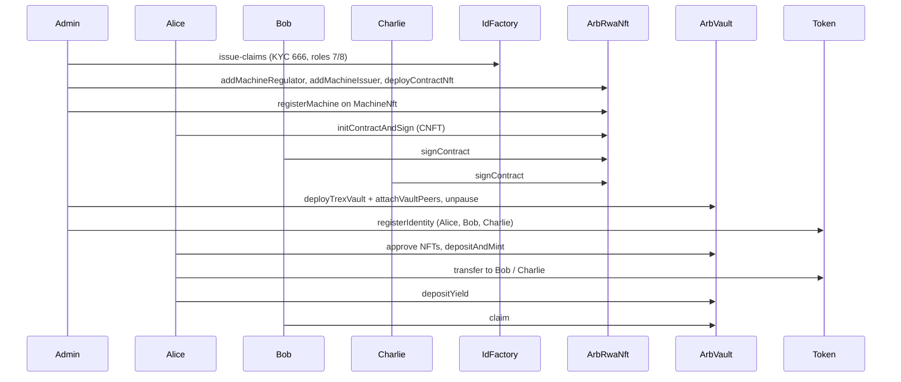

# Testing RWA Contracts in Scaffold ETH 2 (ONCHAINID)

> **Primary run guide:** see [../RUN_GUIDE.md](../RUN_GUIDE.md) for the full step-by-step (quick start, debug UI phases, env vars, troubleshooting).

This page is a shorter SE-2-focused reference. Production target: **Arbitrum** — see [ARBITRUM.md](./ARBITRUM.md).

---

## What you are testing

An end-to-end compliant RWA path:

1. **Onboard** — ONCHAINID proxy identities + KYC claims for Alice, Bob, Charlie  
2. **Assets** — Machine NFTs (issuer) + multi-party Contract NFT  
3. **Vault** — Admin creates vault, unpauses token, registers investors in T-REX `IdentityRegistry`  
4. **Mint** — Alice collateralizes NFTs and mints ERC-3643 security tokens  
5. **Transfer & yield** — Compliant transfers to Bob/Charlie, yield deposit and claims  

| Layer | Contracts |
|-------|-----------|
| Config | `InfoDesk`, `MockFeeToken` |
| Identity | ONCHAINID `IdFactory`, proxy `Identity`, `ClaimIssuer` |
| NFT registry | `ArbRwaNft`, `MachineNft`, `ContractNft` |
| Vault | `ArbVaultFactory`, `ArbVault`, T-REX `Token`, `RewardDistributor` |
| Compliance | `NativeTransferFeeModule`, T-REX `ModularCompliance` |

**Claim topics** (`RwaConstants.sol`):

| Constant | Value |
|----------|-------|
| KYC approved | `666` |
| Machine issuer | `7` |
| Machine regulator | `8` |
| Claim scheme (ECDSA) | `1` |
| Investor country (tests) | `276` (Germany) |

`ArbRwaNft` does **not** use a manual `setIssuerIdentity` mapping. It resolves each wallet’s identity via `IdFactory.getIdentity(wallet)` and validates claims with `ClaimIssuer.isClaimValid`.

---

## Before you start

**Three terminals** (all from `frontend/`):

```bash
yarn chain                                    # Terminal 1 — keep running
yarn deploy --tags RwaFramework --reset       # Terminal 2 — deploy + debug bootstrap (see below)
yarn start                                    # Terminal 3 — UI at http://localhost:3000
```

Default deploy runs **debug bootstrap**: ONCHAINID claims, `MachineNft` / `ContractNft`, vault + token, investor registration, and optional demo NFTs for Alice. You do **not** need a separate `yarn issue-claims` unless you redeployed with `SKIP_DEBUG_BOOTSTRAP=true`.

Production / custom bootstrap:

```bash
SKIP_DEBUG_BOOTSTRAP=true yarn deploy --tags RwaFramework --reset
yarn issue-claims   # then manual Phase 0+ on /debug
```

Open **http://localhost:3000/debug** — Contract UI for deployed contracts.

**Network:** Local Hardhat (`31337`). `scaffold.config.ts` targets `chains.hardhat`.

### Burner wallets

| Account | Role | Address (default) |
|---------|------|-------------------|
| **#0** | Admin / deployer / regulator / issuer / claim signer (local) | `0xf39Fd6e51aad88f6F4ce6aB8827279cffFb92266` |
| **#1** | Alice (asset owner, vault controller) | `0x70997970C51812dc3A010C7d01b50e0d17dc79C8` |
| **#2** | Bob | `0x3C44CdDdB6a900fa2b585dd299e03d12FA4293BC` |
| **#3** | Charlie | `0x90F79bf6EB2c4f870365E785982E1f101E93b906` |
| **#4** | Extra signer (optional) | `0x15d34AAf54267DB7D7c367839AAf71A00a2C6A65` |

Deploy mints **10,000 MockFeeToken** to accounts **#1–#4** for fees.

### Contracts on the Debug page (after default deploy)

`MockFeeToken`, `InfoDesk`, `IdFactory`, `ClaimIssuer`, `ArbRwaNft`, `ArbVaultFactory`, **`MachineNft`**, **`ContractNft`**, **`Token`**, **`IdentityRegistry`**, **`ArbVault`**, **`RewardDistributor`**, **`NativeTransferFeeModule`** (fee module proxy).

Deploy logs print demo IDs for collateral:

```
Debug UI ready — use these IDs for depositAndMint:
  machineTokenId: 202604042
  assetSerial: VEH-2026-CYBER-DLV-0042
  dealReference: CYBER-AUTO-DELIVERY-2026-0042
  vehicle: Tesla Cybertruck (automated last-mile delivery)
  contractId: <uint256 from initContractAndSign>
```

### Issue claims (only if bootstrap skipped)

If you set `SKIP_DEBUG_BOOTSTRAP=true`, copy **ClaimIssuer** from deploy log into `.env` as `CLAIM_ISSUER_ADDRESS` and run `yarn issue-claims`.

---

## Faster paths (skip UI)

| Path | Command |
|------|---------|
| Hardhat test (contracts package) | `cd contracts && npm test` |
| Full demo on localhost | Terminal 1: `yarn chain` (frontend) → Terminal 2: `cd contracts && npm run demo:flow:node` |
| Automated claims only | `yarn issue-claims` after deploy |

---

## Phase-by-phase in Scaffold-ETH Debug

Switch the **burner wallet** in the header before each write.

### After default deploy (bootstrap already ran)

| Done automatically | You do in /debug |
|--------------------|------------------|
| Identities + KYC (666) for Alice, Bob, Charlie | — |
| Admin machine roles (7, 8), `MachineNft`, `ContractNft` | — |
| Vault, `Token`, unpause, `registerIdentity` ×3 | — |
| Demo Machine NFT + completed Contract NFT for Alice (unless `SKIP_DEMO_ASSETS=true`) | Phases 6–9 below |

**Your main manual steps:** approve vault → `depositAndMint` → transfers → yield.

---

### Phase 0 — Bootstrap (Admin #0) — skip if default deploy

**Goal:** Register the protocol roles and deploy the NFT templates Alice will use as collateral.

1. **`ArbRwaNft.addMachineRegulator`** → Admin address (`0xf39F…2266`).  
   **What this does:** Marks Admin as a machine regulator. The contract checks that Admin’s ONCHAINID identity has a valid **topic 8** claim from the configured `ClaimIssuer` (issued by `yarn issue-claims`).

2. **`ArbRwaNft.deployContractNft`** → save the returned **ContractNft** address.  
   **What this does:** Deploys a new Contract NFT collection instance wired to `InfoDesk` fee settings. Alice will init a multi-party agreement on this contract.

3. **`ArbRwaNft.addMachineIssuer`** → Admin address (same as issuer for local testing).  
   **What this does:** Verifies Admin has **topic 7** (machine issuer) on their ONCHAINID identity, then deploys a **MachineNft** contract for that issuer and links it in the registry.

4. **`ArbRwaNft.getMachineNftByIssuer`** → Admin address → save **MachineNft** address.  
   **What this does:** Read-only lookup of the Machine NFT contract created in step 3.

> **Note:** You do **not** call `setIssuerIdentity` — that was removed. Identities come from ONCHAINID `IdFactory`; role checks use on-chain claim validation.

**If `addMachineRegulator` or `addMachineIssuer` reverts:** Run `yarn issue-claims` again (or redeploy + issue-claims). Admin must have topics **8** and **7** respectively.

---

### Phase 1 — Identities + KYC

**Goal:** Give Alice, Bob, and Charlie ONCHAINID identities with KYC so T-REX can treat them as verified investors later.

**If you ran `yarn issue-claims`:** This phase is already done for accounts #1–#3 and Admin.

**Verify (read, any account) on `IdFactory`:**

- `getIdentity(aliceAddress)` → non-zero proxy identity address.

**What this does:** Confirms each investor has an ERC-734/735 ONCHAINID proxy tied to their wallet. Without this, vault `registerIdentity` and compliant transfers will fail.

**Optional manual create (Admin #0 on `IdFactory`):**  
`createIdentity(wallet, salt)` only if you skipped `issue-claims` for that wallet. Caller must be IdFactory owner (deployer).

---

### Phase 2 — Machine NFT (Alice #1 + Admin #0)

**Goal:** Tokenize a physical/logical “machine” asset as an NFT owned by Alice, with fees paid in MockFeeToken.

**Alice (#1) on `MockFeeToken`:**

- `approve(spender, amount)` → spender = **MachineNft** address, amount = registration fee (e.g. `119990000000000000000000` = 119,990 MockFeeToken units — Cybertruck MSRP stand-in).

**What this does:** Lets the MachineNft contract pull the registration fee from Alice when the issuer registers the fleet vehicle.

**Admin (#0) on `MachineNft`** (paste address in Debug or use Block Explorer tab):

- `registerMachine(machineOwner, machineValue, tokenId, did)`  
  - `machineOwner` = Alice  
  - `machineValue` = 119,990 ether units (`119990000000000000000000`) — MockFeeToken stand-in for Tesla Cybertruck valuation  
  - `tokenId` = e.g. `202604042` (fleet inventory id)  
  - `did` = UTF-8 bytes of e.g. `did:arbitrum:machine:VEH-2026-CYBER-DLV-0042`

**What this does:** Mints the machine NFT to Alice and records machine metadata/DID. The fee is deducted from Alice’s approved balance.

**Check:** `MachineNft.ownerOf(tokenId)` = Alice.

---

### Phase 3 — Contract NFT (Alice #1, Bob #2, Charlie #3)

**Goal:** Create a multi-party off-chain agreement NFT that all parties must sign before it counts as collateral.

**Alice (#1) on `MockFeeToken`:**

- `approve(ContractNftAddress, setupFee)` — setup fee = `InfoDesk.getValue(3)` (deploy sets `0.01 ether`).

**What this does:** Pays the one-time contract NFT initialization fee.

**Alice (#1) on `ContractNft`:**

- `initContractAndSign(counterparties, hashDigest, url)`  
  - `counterparties`: `[bobAddress, charlieAddress]`  
  - `hashDigest`: keccak256 of canonical agreement JSON (bootstrap uses `CYBER-AUTO-DELIVERY-2026-0042` metadata for a Tesla Cybertruck automated delivery lease)  
  - `url`: e.g. `ipfs://bafybeihdwdcefgh4dqkjv67uzcmw7ojee6xedzwszojzjbzhcng4xz3fa`  
- Save **`contractId`** from the transaction.

**What this does:** Opens a contract record and records Alice’s signature; Bob and Charlie must still sign.

**Bob (#2) then Charlie (#3) on `ContractNft`:**

- `signContract(contractId)` each.

**What this does:** Completes the multi-party agreement. When all required parties signed, ownership consolidates to Alice as the asset owner for vault purposes.

**Check:** `ContractNft.ownerOf(contractId)` = Alice.

---

### Phase 4 — Vault + security token (Admin #0) — skip if default deploy

**Goal:** Spin up an ERC-3643 T-REX security token, link vault/compliance, and make the token transferable.

You need from deploy logs (or `deployedContracts.ts`):

- **ClaimIssuer** — `ClaimIssuer ONCHAINID (KYC): 0x...`  
- **Fee module proxy** — `NativeTransferFeeModule proxy: 0x...`

**Option A — one transaction (heavy gas):**  
`ArbVaultFactory.createVault` with vault taker Alice, name/symbol, fee token, claim issuers `[claimIssuer]`, topics `[666]`, compliance `[feeModuleProxy]`.

**Option B — two steps (matches tests, better for mainnet-sized bytecode):**

1. `deployTrexVault(name, symbol, [claimIssuer], [666], [feeModuleProxy])` → save **token** address.  
   **What this does:** Deploys the T-REX token + identity registry + compliance stack for this vault.

2. `attachVaultPeers(tokenAddr, alice, feeToken, [feeModuleProxy])` → listen for **`VaultCreated`**.  
   **What this does:** Wires `ArbVault`, `RewardDistributor`, and peer contracts; emits addresses you need next.

From **`VaultCreated`**, save:

- **vault** (`ArbVault`)  
- **token** (ERC-3643 security token)  
- **distributor** (`RewardDistributor`)

Then **`ArbVaultFactory.unpauseVaultToken(vaultAddress)`**.

**What this does:** Allows minting and transfers on the security token (while compliance modules still enforce KYC/country rules).

**Check:** On the token contract, `paused()` → `false`.

---

### Phase 5 — Register investors (Admin #0) — skip if default deploy

**Goal:** Link each investor’s ONCHAINID identity to this vault’s T-REX identity registry so transfers comply with ERC-3643.

On the vault’s **`IdentityRegistry`** (read `token.identityRegistry()`):

For Alice, Bob, Charlie:

- `registerIdentity(userAddress, identityAddress, 276)`  
  Use identity addresses from Phase 1 / `IdFactory.getIdentity(user)`.

**What this does:** Tells this vault’s compliance layer which ONCHAINID contract represents each investor and their country code. Unregistered wallets cannot receive tokens.

**Check:** `isVerified(bobAddress)` → `true`.

---

### Phase 6 — Approve vault for NFTs (Alice #1)

**Goal:** Allow the vault to take custody of NFTs during minting.

On **`MachineNft`:** `approve(vaultAddress, machineTokenId)` — use `machineTokenId` from deploy log (default `202604042`).  
On **`ContractNft`:** `approve(vaultAddress, contractId)` — use `contractId` from deploy log.

**`vaultAddress`:** read from **`ArbVault`** contract card on /debug (or deploy log).

**What this does:** ERC-721 approval so `ArbVault.depositAndMint` can transfer NFTs into the vault as collateral.

---

### Phase 7 — Deposit and mint (Alice #1)

**Goal:** Lock collateral NFTs in the vault and mint ERC-3643 security tokens to Alice.

**`ArbVault` (`vaultAddress`):**

- `depositAndMint(rwaNftAddresses, tokenIds, amount)`  
  - `rwaNftAddresses`: `[machineNftAddr, contractNftAddr]`  
  - `tokenIds`: `[machineTokenId, contractId]`  
  - `amount`: e.g. `100000000000000000000` (100 tokens, 18 decimals)

**What this does:** Moves approved NFTs into vault custody and mints the configured amount of compliant security tokens to Alice. A second mint should revert (`Already minted`).

**Check:** Security **Token** `balanceOf(alice)` increased.

---

### Phase 8 — Transfers (Alice #1 → Bob #2, Charlie #3)

**Goal:** Move security tokens between KYC-registered investors; compliance and fee module run on each transfer.

1. **`ArbVault.transactionFeeAndAccount(transferAmount)`** → `(fee, account)`.  
   **What this does:** Reads the fee required for this transfer size from `InfoDesk` / fee module config.

2. **Alice on `MockFeeToken`:** `approve(feeModuleProxy, fee)` (per transfer if needed).  
   **What this does:** Pays the native-transfer fee in the fee token.

3. **Alice on `Token`:** `transfer(recipient, amount)` for Bob, then Charlie.

**What this does:** ERC-3643 transfer with modular compliance (KYC, country, fee module). Unregistered wallets **revert**.

---

### Phase 9 — Yield (optional)

**Goal:** Distribute yield in the fee token to token holders via `RewardDistributor`.

1. **Alice (#1) on `MockFeeToken`:** `approve(distributorAddress, yieldAmount)`.  
2. **Alice on `RewardDistributor`:** `depositYield(yieldAmount)`.  
   **What this does:** Funds the distributor pool pro-rata for security token holders.

3. **Bob (#2) on `RewardDistributor`:** `claim()` and optionally `claimTo(charlieAddress)`.  
   **What this does:** Bob withdraws his share of yield; `claimTo` sends Bob’s entitlement to Charlie if configured.

---

## Flow diagram



---

## Advanced: Hardhat console (custom claims only)

Use this only if you need claims beyond what `yarn issue-claims` issues. **Do not** use `RwaIdentity` — identities are ONCHAINID proxies.

```bash
cd frontend/packages/hardhat
yarn hardhat console --network localhost
```

Use helpers from `scripts/lib/claims.ts` (`addClaim`, `encodeKycData`, `encodeRoleData`) and addresses from `deployedContracts.ts` + deploy log for `ClaimIssuer`.

Example pattern (TypeScript project — adapt to your ethers import):

```javascript
// IdFactory + ClaimIssuer from deployedContracts.ts / .env
await addClaim(alice, aliceIdentity, admin, claimIssuerAddr, 666n, await encodeKycData("Alice", "Test", "1990-01-01", "Berlin"));
```

---

## Verification checklist

| Step | Read | Expected |
|------|------|----------|
| Identity | `IdFactory.getIdentity(alice)` | Non-zero |
| KYC claim | `getClaimIdsByTopic(666)` on identity (ONCHAINID) | At least one claim id |
| Regulator role | `addMachineRegulator(admin)` | Succeeds after topic **8** claim |
| Issuer role | `addMachineIssuer(admin)` | Succeeds after topic **7** claim |
| Machine | `MachineNft.ownerOf(tokenId)` | Alice |
| CNFT | `ContractNft.ownerOf(contractId)` | Alice |
| Token | `Token.paused()` | `false` |
| Investor | `IdentityRegistry.isVerified(bob)` | `true` |
| Mint once | second `depositAndMint` | Reverts |
| Transfer | `Token.balanceOf(bob)` | Increased |

---

## Common pitfalls

| Issue | Fix |
|-------|-----|
| “Not a contract” / `0x` on reads | Chain reset without redeploy → `yarn deploy --reset` + `yarn issue-claims` + refresh browser |
| `createIdentity` reverts | Caller must be **IdFactory owner** (Admin #0), not Alice |
| `addMachineRegulator` reverts | Admin needs valid ONCHAINID claim **topic 8** → run `yarn issue-claims` |
| `addMachineIssuer` reverts | Admin needs valid claim **topic 7** → run `yarn issue-claims` |
| `setIssuerIdentity` not found | Removed — use ONCHAINID claims instead |
| Machine registration fails | Alice must `approve` **MachineNft**, not treasury |
| Transfer fails | Register identity in vault IR + approve **fee module** for fee |
| Wrong ClaimIssuer in claims | `CLAIM_ISSUER_ADDRESS` in `.env` must match latest deploy |
| Contract too large on mainnet | Use `deployTrexVault` + `attachVaultPeers` (two txs), not single `createVault` |

---

## Who does what

| Party | SE-2 wallet | Main actions |
|-------|-------------|--------------|
| Admin | **#0** | Deploy, `issue-claims`, vault setup, `registerIdentity`, regulator/issuer on `ArbRwaNft` |
| Claim issuer | **#0** (local) | Signs claims in `issue-claims` / `addClaim` |
| Machine regulator | **#0** | `addMachineRegulator` |
| Machine issuer | **#0** | `registerMachine` on **MachineNft** |
| Alice | **#1** | Fees, CNFT init, NFT approvals, `depositAndMint`, transfers, `depositYield` |
| Bob / Charlie | **#2** / **#3** | `signContract`, receive tokens, `claim` |

---

## Option A — Hardhat only (no UI)

```bash
cd contracts
npm install
npm test
npm run deploy:local
npm run issue-claims:local
npm run demo:flow:node   # full flow against yarn chain
```

---

## Option B — Scaffold ETH setup (first time)

See sections above for `yarn chain` / `yarn deploy` / `yarn issue-claims` / `yarn start`.

Copy contracts from this repo into `frontend/packages/hardhat/contracts/` (already done in **Arbitrum-Machine-RWA-framework**). Hardhat config needs:

- Solidity **0.8.17**, `viaIR: true`, `allowUnlimitedContractSize: true` on `hardhat` network  
- `@onchain-id/solidity@^2.2.1`, `@openzeppelin/contracts@4.9.6`  

Deploy script: `frontend/packages/hardhat/deploy/00_deploy_rwa_framework.ts`.

---

## File reference

| File | Purpose |
|------|---------|
| `frontend/packages/hardhat/scripts/issueClaims.ts` | KYC + machine claims after deploy |
| `frontend/packages/hardhat/scripts/lib/claims.ts` | ONCHAINID `addClaim` helpers |
| `contracts/scripts/issueClaims.js` | Same flow for standalone `contracts/` package |
| `contracts/scripts/fullFlowDemo.js` | Automated E2E without UI |
| `contracts/test/RwaFullFlow.test.js` | Hardhat test suite |
| [TEST_GUIDE.md](./TEST_GUIDE.md) | Extended checklist |
| [ARBITRUM.md](./ARBITRUM.md) | Arbitrum Sepolia / mainnet deploy |

---

## Recommended order

1. `yarn deploy --tags RwaFramework --reset` + `yarn issue-claims`  
2. Manual Debug UI phases 0–9  
3. `cd contracts && npm test` for regression  
4. `npm run demo:flow:node` to compare with UI flow  
5. External audit before production on Arbitrum  
