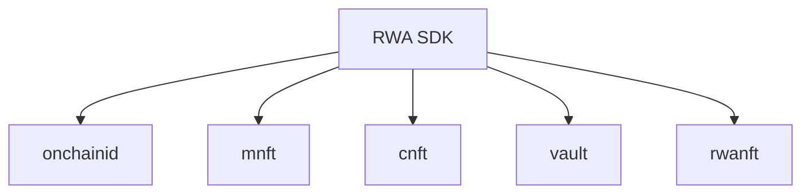

The **Arbitrum Machine Real World Asset (RWA) Framework** is on-chain infrastructure for representing physical assets—chiefly machines—as compliant digital securities on **Arbitrum**. It gives integrators a regulated path from asset registration through fractional ownership and yield distribution.


Three standards form the foundation:

- [**ONCHAINID**](https://github.com/onchain-id/solidity) — Links wallet addresses to verified on-chain identities and KYC claims.
- [**T-REX (ERC-3643)**](https://github.com/ERC-3643/ERC-3643) — Regulated security tokens with transfer rules enforced by an Identity Registry.
- [**ERC-721**](https://github.com/OpenZeppelin/openzeppelin-contracts/blob/master/contracts/token/ERC721/ERC721.sol) — Unique collateral: **Machine NFTs** (physical assets) and **Contract NFTs** (multi-party agreements).

Smart contracts live in the [Arbitrum Machine RWA framework](https://github.com/Bleyle823/Arbitrum-Machine-RWA-framework) repository. The **`@arbitrum-machine/rwa-sdk`** npm package exposes them through a typed TypeScript API.

## End-to-end capability

With the framework you can:

1. Register machines as NFTs carrying embedded DID documents
2. Bundle Machine and Contract NFTs into an **Arb Vault**
3. Mint ERC-3643 security tokens to verified investors
4. Route operational yield to token holders through a reward distributor

## SDK modules



| Module | Responsibility |
|--------|----------------|
| `sdk.onchainid` | Identity lifecycle, KYC reads, claim attachment |
| `sdk.mnft` | Machine registration and DID metadata |
| `sdk.cnft` | Multi-party contract NFTs |
| `sdk.vault` | Collateral deposit, mint, transfer, yield |
| `sdk.rwanft` | ArbRwaNft factory inspection (regulators / issuers) |

Pass a `provider` for read calls; pass a `Signer` on each write method.

Module-by-module detail: [Core Modules](/concepts/modules).

## Networks

| Network | Chain ID | Enum |
|---------|----------|------|
| Arbitrum One | 42161 | `Chain.ARBITRUM_ONE` |
| Arbitrum Sepolia | 421614 | `Chain.ARBITRUM_SEPOLIA` |

## Contract addresses

Bundled per chain under `sdk/src/addresses/`. After redeploying, run [Sync Addresses](/maintainers/sync-addresses).

### Arbitrum Sepolia (reference deployment)

```js
chainId: 421614,
idFactory: '0xE90B0Ccc2382e0eEEC391bC9169B1c17329e3c32',
claimIssuer: '0xd95642cA55d0F021277a15B55225693241A98372',
arbRwaNft: '0x99df0787a305625e0110b258fd2e8c213de342d7',
arbVaultFactory: '0x53d17830deff8c53a4785475df833f967ab1b32a',
machineNft: '0x521E76c50F9e8CD7F63023e9cF6465b915425df7',
contractNft: '0xC080f3B4373a49fb19587122bb48407a8CDbeE63',
arbVault: '0xCea36ec9320a3e1d0cC278e8B99f5ab217E85755',
token: '0xD0067d0Bf335a8475252daCE828A274705B01aA8',
identityRegistry: '0xb0A4B2b5F982232f3EE7cF5bb5bebd506B0A02ae',
rewardDistributor: '0xCDE1dc7e8C917CAf727EB5eEe0f45b26041a6feB',
feeToken: '0x086caad51b5d709ef94f03815abcd5c554ad6a60',
feeModule: '0xbBb404e7c839486fAAB8e6510Cd0F4e6b4CAA7D1',
```

Resolve at runtime:

```typescript
import { RWA, Chain } from "@arbitrum-machine/rwa-sdk";

const sdk = new RWA({ chainId: Chain.ARBITRUM_SEPOLIA, provider });
console.log(sdk.getManifest());
console.log(sdk.getAddresses());
```

### Arbitrum One

Mainnet addresses ship with the SDK as deployments are published. Until then, pass a custom `manifest` to `new RWA({ …, manifest })`.

## Next steps

- **[Core Modules](/concepts/modules)** — Module responsibilities and API links
- **[Roles & Responsibilities](/concepts/roles)** — Framework Owner through Investor
- **[SDK Reference](/sdk-reference/initialize)** — Install, initialize, and call the SDK
- **[Manual Testing (SDK)](/workflows/manual-testing-sdk)** — Step-by-step without automation scripts
- **[Smart Contract Testing](/smart-contracts/guide)** — Hardhat deploy and verification
