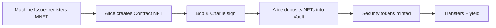

## Asset lifecycle

1. **Identity**: Each participant gets an ONCHAINID and KYC claim.
2. **Machine NFT**: Represents a physical machine with an embedded DID document.
3. **Contract NFT**: Multi-party agreement linking counterparties to collateral.
4. **Vault**: Holds NFT collateral and mints ERC-3643 security tokens.
5. **Yield**: Deposited into the reward distributor; holders claim pro-rata.

## Bundled manifest

`RWA.getManifest()` returns deployment metadata:

- Contract addresses (IdFactory, ClaimIssuer, ArbRwaNft, MachineNft, ContractNft, ArbVault, Token, …)
- Demo participant EOAs (Alice, Bob, Charlie)
- Pre-registered machine and contract token IDs (after bootstrap)

Use `sdk/scripts/sync-addresses.mjs` after redeploying Hardhat contracts to refresh the bundled JSON.

See [Core Modules](/concepts/modules) and [Roles & Responsibilities](/concepts/roles) for framework architecture detail.

## SDK conventions

| Area | Value |
|------|-------|
| Package | `arbitrum-machine-rwa-sdk` |
| Networks | Arbitrum Sepolia / Robinhood Chain Testnet / Arbitrum One |
| RPC env | `ARB_SEPOLIA_RPC_URL`, `ROBINHOOD_TESTNET_RPC_URL` |
| Admin bootstrap | Hardhat deploy + bootstrap scripts |
| Fee token | MockFeeToken (demo on Sepolia) |

Some admin operations (`createVault`, `registerIdentity`, full KYC bootstrap) are handled by **bootstrap scripts** rather than SDK write methods. See [Maintainers: Deploy](/maintainers/deploy).
