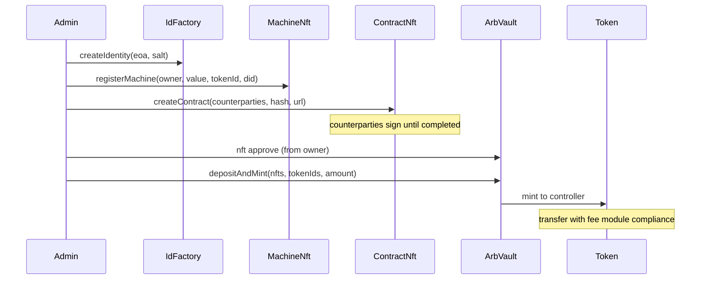

Use this guide when you want to **interact with contracts directly** (Hardhat scripts, `ethers`, Arbiscan, or the `/rwa` UI) rather than through `arbitrum-machine-rwa-sdk`.

## Two Hardhat projects

| Path | Use when |
|------|----------|
| `contracts/` | Fast **local unit tests** and a minimal standalone deploy (`npm test`, `npm run demo:flow`) |
| `frontend/packages/hardhat/` | **Monorepo** deploy to Arbitrum Sepolia or Robinhood Chain Testnet, bootstrap demo state, and Scaffold ETH UI |

Both share the same Solidity sources under `frontend/packages/hardhat/contracts/src/` (the `contracts/` folder is a portable copy for CI and standalone work).

---

## Track 1: Local unit tests (recommended first step)

Runs entirely on the in-memory Hardhat network. No RPC URL or private keys required.

```bash
cd contracts
npm install
npm test
```

### What runs

| Test file | Covers |
|-----------|--------|
| `test/RwaFullFlow.test.js` | Full flow: ONCHAINID → Machine NFT → T-REX vault → `depositAndMint` → transfer → yield → `burnAndRedeem` |
| `test/ContractNft.test.js` | Contract NFT draft, signing, completion, and view helpers |

The full-flow test deploys these contracts in-process:

1. `MockFeeToken`, `InfoDesk`, ONCHAINID stack (`IdFactory`, `ClaimIssuer`)
2. ERC-3643 T-REX suite via `deployTrexSuite`
3. `ArbRwaNft`, `MachineNft`, `ArbVaultFactory`
4. KYC claims (topic `666`) and machine role claims (topics `7`, `8`)
5. `ArbVault.depositAndMint`, token transfer with fee module, yield claim, redemption

Expect output similar to:

```text
  RWA full flow (ERC-3643 T-REX)
    ✓ deploys framework and runs identity → machine → T-REX vault → transfer
```

---

## Track 2: Local end-to-end demo script

Same flow as the unit test, but as a **script you can step through** on a persistent local node.

**Terminal 1**: start a node:

```bash
cd contracts
npx hardhat node
```

**Terminal 2**: run the demo:

```bash
npx hardhat run scripts/fullFlowDemo.js --network localhost
```

The script prints contract addresses and walks through identity creation, machine registration, vault setup, minting, transfers, and yield, all via direct `ethers` contract calls (no SDK).

---

## Track 3: Arbitrum Sepolia (live testnet)

Deploy and bootstrap the framework on a public network, then verify on-chain state.

### Prerequisites

- Node.js 18+ (monorepo recommends 22+)
- Deployer wallet funded with **Arbitrum Sepolia ETH**
- Copy `frontend/packages/hardhat/.env.example` → `frontend/packages/hardhat/.env`

Minimum setup:

```bash
# frontend/packages/hardhat/.env
ARB_SEPOLIA_RPC_URL=https://sepolia-rollup.arbitrum.io/rpc
DEPLOYER_KEYSTORE_FILE=.secrets/deployer.keystore.json
# or DEPLOYER_PRIVATE_KEY=0x...

# Optional: full automated demo NFT seeding
ALICE_PRIVATE_KEY=0x...
BOB_PRIVATE_KEY=0x...
CHARLIE_PRIVATE_KEY=0x...
```

Import or generate a deployer account:

```bash
cd frontend
yarn account:import    # or yarn account:generate
```

### Step 1: Deploy framework contracts

From `frontend/`:

```bash
yarn deploy:arbitrum-sepolia
```

This deploys (via Rocketh / `deploy/00_deploy_rwa_framework.ts`):

- `MockFeeToken` (unless `FEE_TOKEN_ADDRESS` is set)
- `InfoDesk`, `IdFactory`, `ClaimIssuer`
- ERC-3643 T-REX implementation proxies
- `ArbRwaNft`, `ArbVaultFactory`, `NativeTransferFeeModule`

Artifacts are written to `frontend/packages/hardhat/deployments/arbitrumSepolia/*.json`.

### Step 2: Bootstrap vault, identities, and demo assets

```bash
yarn bootstrap:arbitrum-sepolia
```

Bootstrap runs `scripts/bootstrapRwa.ts` and:

1. Mints MockFeeToken to Alice, Bob, and Charlie
2. Creates ONCHAINID identities and KYC claims
3. Adds machine regulator + issuer on `ArbRwaNft`
4. Deploys `MachineNft` and `ContractNft` instances
5. Creates vault + ERC-3643 token via `ArbVaultFactory`
6. Registers investors in the vault Identity Registry
7. Unpauses the security token
8. Optionally seeds demo Machine NFT + completed Contract NFT (when participant keys are set)
9. Writes `frontend/packages/nextjs/public/rwa-manifest.json` for the UI

### Step 3: Verify on-chain state

**Hardhat read-only check** (manifest + deployments):

```bash
yarn verify:demo-state
```

**SDK read-only check** (after syncing addresses):

```bash
cd sdk
node scripts/sync-addresses.mjs
npm run build
node scripts/verify-workflow.mjs
```

### Optional follow-ups

| Command | Purpose |
|---------|---------|
| `yarn seed:demo-assets` | Re-seed demo Machine/Contract NFTs if bootstrap skipped assets |
| `yarn issue-claims:arbitrum-sepolia` | Re-issue KYC / role claims after redeploy |
| `yarn hardhat-verify --network arbitrumSepolia` | Verify contracts on Arbiscan (`ETHERSCAN_API_KEY` in `.env`) |

---

## Track 4: Robinhood Chain Testnet (live testnet)

Deploy the same RWA framework on **Robinhood Chain Testnet** (chain id **46630**).

### Prerequisites

- Node.js 18+ (monorepo recommends 22+)
- Deployer wallet funded with **testnet ETH** on Robinhood Chain
- Copy `frontend/packages/hardhat/.env.example` → `frontend/packages/hardhat/.env`

Minimum setup:

```bash
# frontend/packages/hardhat/.env
ROBINHOOD_TESTNET_RPC_URL=https://rpc.testnet.chain.robinhood.com
DEPLOYER_KEYSTORE_FILE=.secrets/deployer.keystore.json
# or DEPLOYER_PRIVATE_KEY=0x...
```

### Step 1: Deploy framework contracts

From `frontend/`:

```bash
yarn deploy:robinhood-testnet
```

Artifacts are written to `frontend/packages/hardhat/deployments/robinhoodChainTestnet/*.json`.

**Deployed framework addresses** (reference):

| Contract | Address |
|----------|---------|
| `ArbRwaNft` | `0xf4e6f7408f2a760f3cbadb14c26fd2c90a3cb611` |
| `ArbVaultFactory` | `0x0b6e3595bbcef688fa2cc288732ae8ac09947398` |
| `IdFactory` | `0x06A326c6F64984bfB07f4a0f1dcaF4D90a936c38` |
| `ClaimIssuer` | `0xCAE0bB0E82BBCbeD3eB3089Df64cc4071b53524f` |
| `MockFeeToken` | `0xc7e34d7722b056f6adf0a4371a6246bf26464189` |
| `NativeTransferFeeModule` | `0x98BE252e69b656B08e142d6FD5Ba70eEa0F0C220` |

### Step 2: Bootstrap vault, identities, and demo assets

```bash
yarn bootstrap:robinhood-testnet
```

Same bootstrap flow as Arbitrum Sepolia (identities, KYC, vault, demo NFTs). Writes `packages/nextjs/public/rwa-manifest.json` when complete.

### Step 3: Verify on-chain state

```bash
yarn verify:demo-state:robinhood-testnet
```

### Optional follow-ups

| Command | Purpose |
|---------|---------|
| `yarn seed:demo-assets:robinhood-testnet` | Re-seed demo Machine/Contract NFTs |
| `yarn issue-claims:robinhood-testnet` | Re-issue KYC / role claims after redeploy |

### UI / MetaMask

Add Robinhood Chain Testnet to MetaMask:

| Field | Value |
|-------|-------|
| RPC URL | `https://rpc.testnet.chain.robinhood.com` |
| Chain ID | `46630` |
| Explorer | `https://explorer.testnet.chain.robinhood.com` |

The Scaffold-ETH app includes Robinhood in `targetNetworks` (`scaffold.config.ts`). Set `NEXT_PUBLIC_ROBINHOOD_TESTNET_RPC_URL` in `packages/nextjs/.env.local` if you need a custom RPC.

---

## Contract-level flow reference

After bootstrap, you can call contracts directly (Hardhat console, cast, or UI):



### Key contract methods

| Phase | Contract | Method | Signer |
|-------|----------|--------|--------|
| Identity | `IdFactory` | `createIdentity(subject, salt)` | Admin |
| KYC | `Identity` (ONCHAINID) | `addClaim(...)` | Identity owner |
| Machine | `MachineNft` | `registerMachine(owner, value, tokenId, did)` | Machine issuer |
| Agreement | `ContractNft` | `createContract(...)` | Controller |
| Agreement | `ContractNft` | `signContract(contractId)` | Counterparty |
| Vault setup | `ArbVaultFactory` | `deployTrexVault` + `attachVaultPeers` | Admin |
| Vault setup | `ArbVaultFactory` | `unpauseVaultToken(vault)` | Admin |
| Registry | `IdentityRegistry` | `registerIdentity(wallet, identity, country)` | Agent |
| Collateral | `MachineNft` / `ContractNft` | `approve(vault, tokenId)` | NFT owner |
| Mint | `ArbVault` | `depositAndMint(nfts, tokenIds, amount)` | Vault controller |
| Transfer | `Token` | `transfer(to, amount)` | Holder (fee allowance required) |
| Yield | `RewardDistributor` | `depositYield(amount)` | Depositor |
| Yield | `RewardDistributor` | `claim()` / `claimTo(addr)` | Holder |

### Read checks (no signer)

```bash
cd frontend/packages/hardhat
npx hardhat console --network arbitrumSepolia
```

```javascript
const vault = await ethers.getContractAt("ArbVault", "<ARB_VAULT_ADDRESS>");
await vault.minted();                    // true after depositAndMint
const token = await ethers.getContractAt("Token", "<TOKEN_ADDRESS>");
await token.balanceOf("<ALICE_ADDRESS>");
const ir = await ethers.getContractAt("IdentityRegistry", await token.identityRegistry());
await ir.isVerified("<BOB_ADDRESS>");
```

Addresses come from `deployments/arbitrumSepolia/` or `rwa-manifest.json`.

---

## Standalone deploy (without the monorepo UI)

If you only need contracts on Sepolia without the Next.js app:

```bash
cd contracts
cp .env.example .env   # set DEPLOYER_PRIVATE_KEY
npm run deploy:arbitrum-sepolia
npm run issue-claims:local   # adjust network flag as needed
```

See `contracts/ARBITRUM.md` and `contracts/TEST_GUIDE.md` for deeper checklists.

---

## Troubleshooting

| Symptom | Likely cause | Fix |
|---------|--------------|-----|
| Bootstrap uses `0xf39F...` (Hardhat default) | Ran without keystore decrypt | Use `yarn bootstrap:arbitrum-sepolia` from `frontend/` |
| `Missing deployments` | Framework not deployed | Run `yarn deploy:arbitrum-sepolia` first |
| `contractId is 0` in verify | Demo assets not seeded | Set `ALICE_*` / `BOB_*` / `CHARLIE_*` keys and re-run bootstrap, or `yarn seed:demo-assets` |
| Transfer reverts | Insufficient fee-token allowance | Approve `NativeTransferFeeModule` or `MockFeeToken` before `Token.transfer` |
| `registerMachine` reverts | Issuer not on `ArbRwaNft` or missing role claim | Run `addMachineRegulator` + `addMachineIssuer` with valid claims |

---

## Next steps

- SDK layer on top of the same contracts: [Common Flow](/workflows/common-flow)
- Sync deployment JSON into the SDK: [Sync Addresses](/maintainers/sync-addresses)
- Maintainer deploy details: [Deploy & Bootstrap](/maintainers/deploy)
