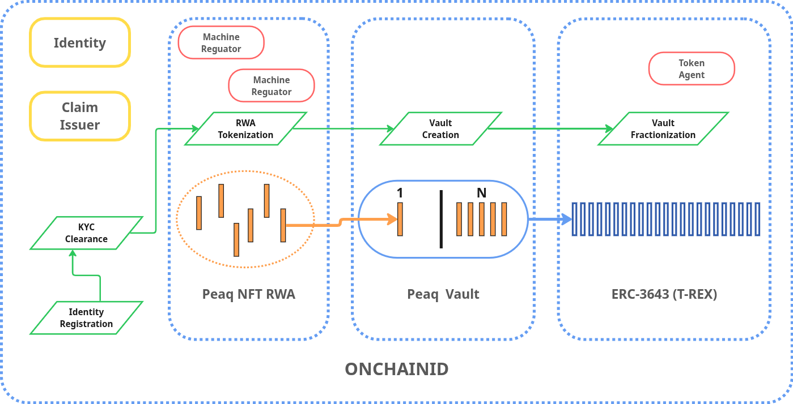
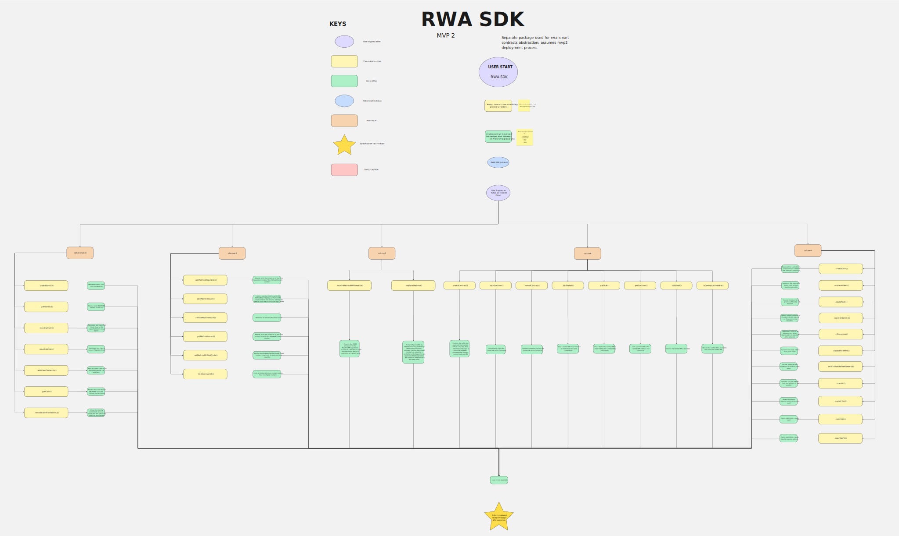
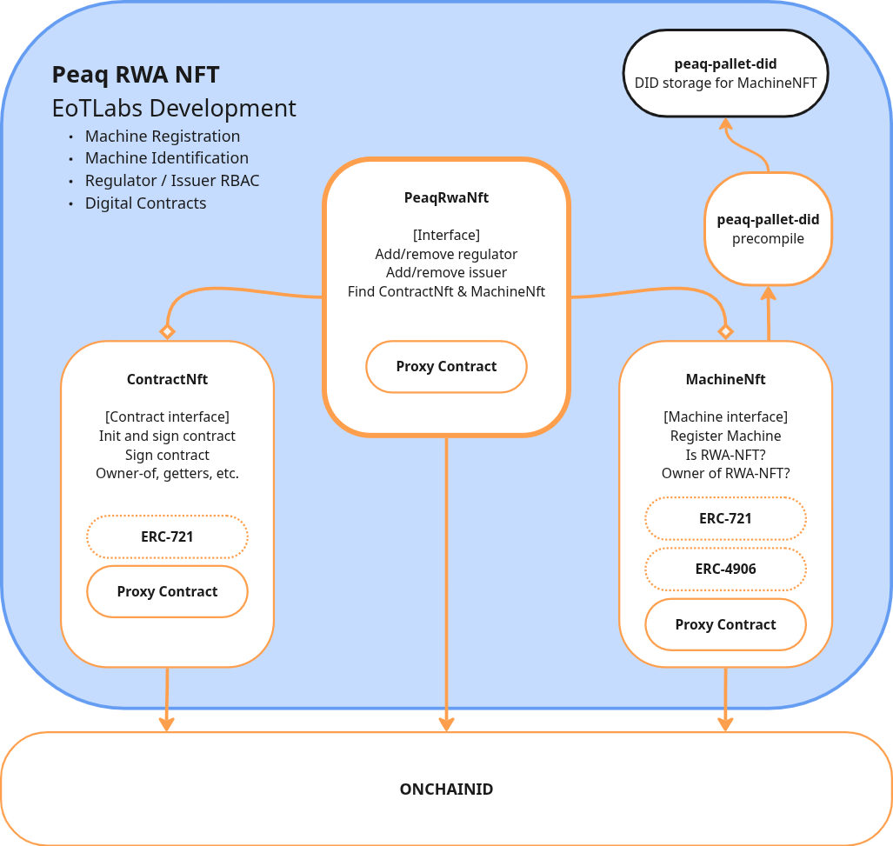
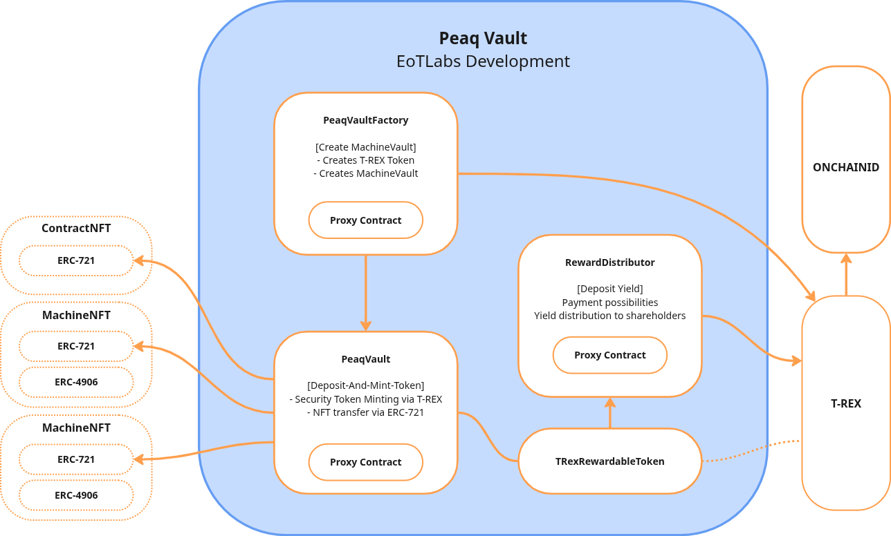

# Introduction to the Arbitrum Machine RWA SDK

## What is the Arbitrum Machine RWA Framework?

The **peaq Real World Asset (RWA) Framework** is a comprehensive blockchain infrastructure that enables the tokenization of physical assets (primarily machines) on the Arbitrum. It provides a compliant, regulated pathway for transforming real-world assets into tradeable digital securities.



At its core, the framework combines three key blockchain standards:

- [**ONCHAINID**](https://github.com/onchain-id/solidity) - A decentralized identity protocol that links wallet addresses to verified identities, enabling Know-Your-Customer (KYC) compliance on-chain.
- [**T-REX (ERC-3643)**](https://github.com/ERC-3643/ERC-3643) - The Token for Regulated EXchanges standard, which provides a security token framework with built-in compliance controls.
- [**ERC-721 NFTs**](https://github.com/OpenZeppelin/openzeppelin-contracts/blob/master/contracts/token/ERC721/ERC721.sol) - Non-fungible tokens that represent unique real-world assets (MachineNFT) and contractual agreements (ContractNFT).

These standards were combined into the [Arbitrum-Machine-RWA-framework](https://github.com/peaqnetwork/Arbitrum-Machine-RWA-framework/tree/dev) repository, where custom business logic is integrated into smart contracts.

The framework enables asset owners to:
1. Register physical machines as on-chain NFTs with embedded DID documents
2. Package those assets into vaults
3. Fractionalize ownership into security tokens that can be sold to investors
4. Distribute yield from machine operations to token holders automatically

---

## SDK Architecture Overview

The **RWA SDK** is a TypeScript/JavaScript library that abstracts the complexity of interacting with the framework's smart contracts. Rather than calling individual contract methods directly, developers instantiate a single SDK object that exposes purpose-built modules for each domain of the framework.



### Initialization

The SDK is initialized with a `chainId` (specifying which Arbitrum to connect to) and a `provider` (an ethers.js provider for blockchain communication):

```
RWA({ chainId: Chain.ARBITRUM_ONE, provider })
```

This returns an SDK instance with five modules pre-configured with the correct contract addresses for the specified chain.

→ See [Project Setup / Initialization](../../sdk_reference/initialize.md) for implementation details.

### Module Architecture

```
┌─────────────────────────────────────────────────────────────┐
│                        RWA SDK                              │
│  ┌─────────────┐ ┌─────────────┐ ┌─────────────┐            │
│  │  onchainid  │ │    mnft     │ │    cnft     │            │
│  │  (Identity) │ │ (Machines)  │ │ (Contracts) │            │
│  └─────────────┘ └─────────────┘ └─────────────┘            │
│  ┌─────────────┐ ┌─────────────┐                            │
│  │    vault    │ │   rwanft    │                            │
│  │  (Tokens)   │ │  (Factory)  │                            │
│  └─────────────┘ └─────────────┘                            │
└─────────────────────────────────────────────────────────────┘
```

Each module handles a specific domain:
- **Read operations** use the provider passed at initialization
- **Write operations** accept a `Signer` as a parameter, allowing different wallets to execute transactions

---

## Core Modules at a Glance

### OnChainID Module (`sdk.onchainid`)

The identity module manages ONCHAINID identities and claims-the foundation of all compliance in the framework.

**Purpose:** Create and manage on-chain identities, issue KYC claims, and handle claim lifecycle operations.

**Key capabilities:**
- **Create identities** - Deploy an `Identity` contract linked to a user's wallet address
- **Retrieve identities** - Look up existing identity contracts by wallet address
- **Issue KYC claims** - Generate and sign claims that verify a user's identity
- **Issue Role claims** - Generate and sign claims that verify a particular role
- **Add claims to identities** - Attach signed claims to identity contracts
- **Remove claims** - Revoke claims when they are no longer valid

Every participant in the framework-whether an investor, machine issuer, or regulator-must have a verified identity with appropriate claims before they can interact with the system.

→ See [Identity SDK Reference](../../sdk_reference/identity/) for implementation details.

---

### Machine NFT Module (`sdk.mnft`)

The Machine NFT module handles the registration and management of tokenized physical assets.



**Purpose:** Register real-world machines as NFTs with embedded DID documents, and manage their lifecycle.

**Key capabilities:**
- **Ensure allowances** - Verify and approve ERC-20 allowances for registration fees
- **Register machines** - Mint MachineNFTs with associated DID documents that describe the physical asset
- **Read DID documents** - Retrieve the machine metadata stored on-chain

Each MachineNFT contains a Decentralized Identifier (DID) document that uniquely identifies the physical machine, including details like manufacturer, model, serial number, and other relevant metadata. This creates an immutable link between the on-chain token and the real-world asset.

→ See [Machine NFT SDK Reference](../../sdk_reference/mnft/) for implementation details.

---

### Vault Module (`sdk.vault`)

The Vault module enables the fractionalization of assets into security tokens and manages yield distribution.



**Purpose:** Create vaults that hold MachineNFTs and ContractNFTs, fractionalize them into security tokens, and distribute yield to token holders.

**Key capabilities:**
- **Create vaults** - Deploy new vault instances with associated security tokens and reward distributors
- **Pause/unpause tokens** - Control token transferability for regulatory or emergency purposes
- **Register identities** - Add verified identities to the vault's identity registry (required for token holders)
- **Deposit and mint** - Lock NFTs in a vault and mint security tokens representing fractional ownership
- **Deposit yield** - Add revenue to the vault for distribution to token holders
- **Claim yield** - Allow token holders to withdraw their share of accumulated yield
- **Transfer tokens** - Move security tokens between verified holders

Security tokens issued by vaults comply with the T-REX (ERC-3643) standard, meaning they have built-in compliance checks that ensure only verified (KYC'd) addresses can hold and transfer them.

→ See [Vault SDK Reference](../../sdk_reference/vault/) for implementation details.

---

### Contract NFT Module (`sdk.cnft`)

The Contract NFT module manages digital agreements between multiple parties.

**Purpose:** Create, sign, and manage multi-party contracts that are represented as NFTs on-chain.

**Key capabilities:**
- **Create contracts** - Initialize a new contract with specified counterparties and document hash
- **Sign contracts** - Allow counterparties to sign and finalize agreements
- **Cancel drafts** - Allow initiators to cancel contracts before all parties have signed
- **Verify contracts** - Validate that document content matches the on-chain hash

ContractNFTs store a hash of the actual document (which may be stored off-chain, e.g., on IPFS) and a URL to retrieve it. This ensures document integrity while keeping large files off the blockchain. Contracts can also be deposited into vaults alongside MachineNFTs.

→ See [Contract NFT SDK Reference](../../sdk_reference/cnft/) for implementation details.

---

### RWA NFT Factory Module (`sdk.rwanft`)

The RWA NFT factory module manages the top-level factory contract that coordinates machine issuers and regulators.

**Purpose:** Administrative operations for the PeaqRwaNft factory contract.

**Key capabilities:**
- **Manage machine regulators** - Add or remove addresses authorized to approve machine issuers
- **Manage machine issuers** - Register new issuers who can mint MachineNFTs
- **Emergency controls** - Block or unblock machine issuers and NFT operations

This module is primarily used by framework administrators rather than end users.

→ See [RWA NFT SDK Reference](../../sdk_reference/rwanft/) for implementation details.

---

## Roles in the Ecosystem

The RWA Framework defines several key roles, each with specific responsibilities and required claims:

| Role | Description | Required Claim |
|------|-------------|----------------|
| **Framework Owner** | Administers the entire framework, manages trusted claim issuers, and creates vaults | Admin access |
| **Claim Issuer** | Issues KYC and role claims to users after verification | Trusted by Framework Owner |
| **Machine Regulator** | Approves machine issuers and oversees their operations | `CT_MNFT_REGULATOR` |
| **Machine Issuer** | Registers physical machines as MachineNFTs | `CT_MNFT_ISSUER` |
| **User / Investor** | Owns MachineNFTs, holds security tokens, and receives yield | `CT_KYC_APPROVED` |

→ See [Roles & Responsibilities](./roles/index.md) for detailed documentation on each role.

---

## Framework Fees

Interacting with the framework incurs fees paid in PEAQ tokens:

| Action | Fee Structure |
|--------|---------------|
| **Machine Registration** | 0.1% of machine value (minimum 10 PEAQ) |
| **MachineNFT Transfer** | 1 PEAQ per transfer |
| **ContractNFT Setup** | Fixed fee (configurable) |
| **Security Token Transfer** | Configurable fee per transaction |

All fees must be approved (via ERC-20 `approve`) before the corresponding transaction is executed.

---

## Next Steps

- **[Roles & Responsibilities](./roles/)** - Detailed documentation for each participant role
- **[Core Concepts](./concepts/)** - Deep dives into claims, identities, vaults, and tokenization
- **[SDK Reference](../../sdk_reference/)** - Complete API documentation with code examples