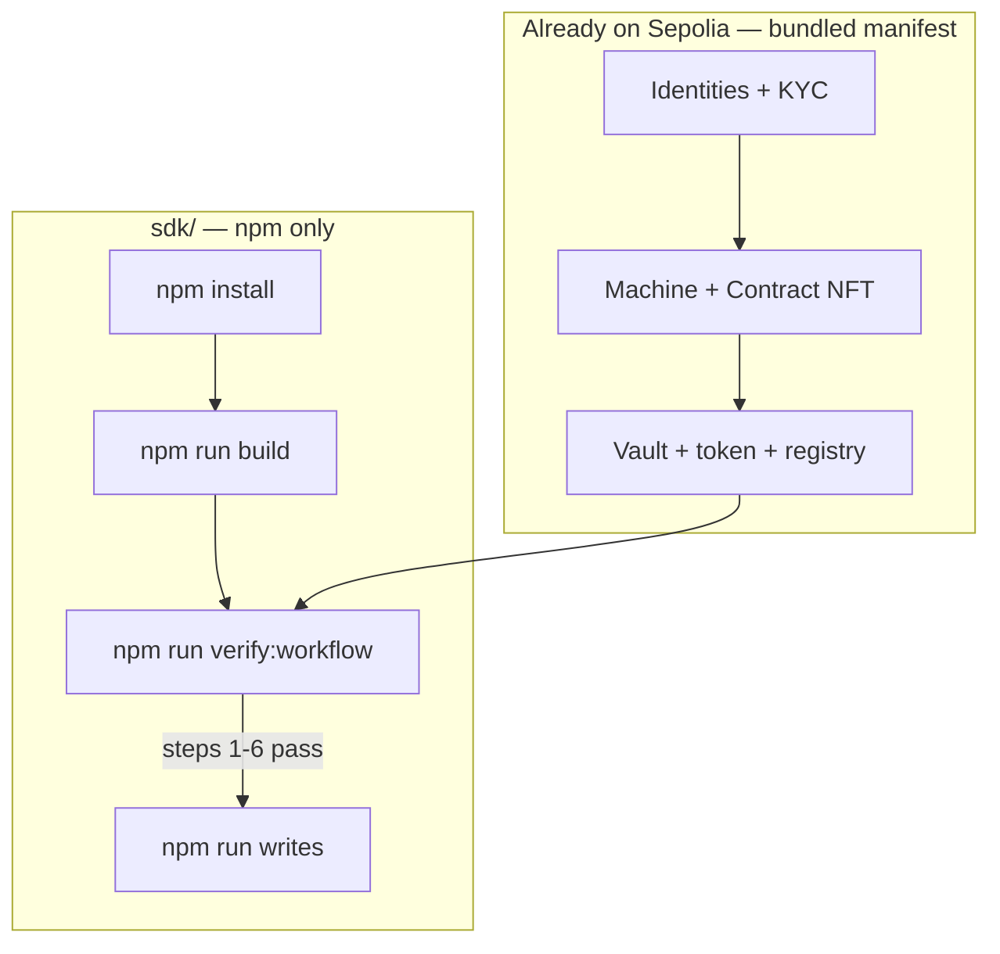

You do **not** need Yarn to work in `sdk/`. Use **npm** for all SDK commands.

<Warning>
Running `yarn` inside `sdk/` may fail if a parent folder (e.g. your user home) has a `packageManager` field set to pnpm. Always use `npm run …` or `node scripts/…` from `sdk/`.
</Warning>

## What you can do from `sdk/` alone

| Goal | Needs frontend/contracts? |
|------|---------------------------|
| Unit tests (no chain) | No |
| Read-only verify against bundled Sepolia deployment | No |
| SDK writes (approve, mint, transfer, yield) | No — uses bundled `arbitrumSepolia.json` + your `.env` keys |
| Refresh manifest after **your** redeploy | Only a manifest JSON file (see sync below) |

Steps **1–6** (deploy framework, bootstrap identities/vault/NFTs) require a Hardhat deploy once. The repo ships a **pre-synced** Sepolia manifest so you can skip that and test SDK reads/writes immediately.

---

## One-time setup

```bash
cd sdk
npm install
cp .env.example .env
```

Edit `.env`:

```bash
ARB_SEPOLIA_RPC_URL=https://sepolia-rollup.arbitrum.io/rpc
ALICE_PRIVATE_KEY=0x...
BOB_PRIVATE_KEY=0x...
CHARLIE_PRIVATE_KEY=0x...
```

Participant addresses must match the bundled manifest (`alice`, `bob`, `charlie` in `src/addresses/arbitrumSepolia.json`) unless you sync a custom manifest.

Build the SDK (required before verify/writes scripts):

```bash
npm run build
```

---

## Command reference (every step)

### A — SDK package health (no network)

| # | Command | What it checks |
|---|---------|----------------|
| A1 | `npm run check-types` | TypeScript compiles |
| A2 | `npm test` | Unit tests (init, build outputs) |

### B — Read-only on-chain verification (Sepolia RPC only)

| # | Command | Workflow sections verified |
|---|---------|--------------------------|
| B1 | `npm run verify:workflow` | 1–6: identities, KYC, Machine/CNFT, vault, token, balances, fees |

Equivalent:

```bash
node scripts/verify-workflow.mjs
```

No private keys required for B1 (reads only).

### C — SDK write steps (needs `.env` keys)

These map to [Common Flow](/workflows/common-flow) steps **7–10**:

| # | Command | SDK method(s) | Who signs |
|---|---------|---------------|-----------|
| C1 | `npm run writes -- --step 7` | `vault.nftApproval` (MNFT + CNFT) | Alice |
| C2 | `npm run writes -- --step 8` | `vault.depositAndMint` | Alice |
| C3 | `npm run writes -- --step 9` | `ensureTransferFeeAllowance`, `vault.transfer` ×2 | Alice |
| C4 | `npm run writes -- --step 10` | `depositYield`, `claimYield`, `claimYieldTo` | Alice, Bob |

Run all write steps in order:

```bash
npm run writes
```

On Windows PowerShell, pass flags directly to the script:

```bash
node scripts/run-sdk-writes.mjs --step 7
```

After each phase, re-verify:

```bash
npm run verify:workflow
```

### D — Refresh bundled addresses (optional)

Only needed after **you** redeploy contracts and have a new `rwa-manifest.json`:

```bash
npm run sync-addresses
npm run build
npm run verify:workflow
```

With explicit paths (no frontend checkout required):

```bash
node scripts/sync-addresses.mjs \
  --manifest /path/to/rwa-manifest.json \
  --deployments /path/to/deployments/arbitrumSepolia \
  --out src/addresses/arbitrumSepolia.json
npm run build
```

If you omit `--manifest`, the script looks for:

1. `../frontend/packages/nextjs/public/rwa-manifest.json`
2. `../contracts/deployments/deployment-421614.json`
3. Falls back to refreshing the existing bundled JSON

---

## Full workflow map



| Flow step | On-chain action | Automated in bundled deploy | SDK verify | SDK write command |
|-----------|-----------------|----------------------------|------------|-------------------|
| 1 | Create identities | Yes (bootstrap) | `verify:workflow` §1 | `onchainid.createIdentity` (custom script) |
| 2 | KYC claims | Yes | `verify:workflow` §1 | `onchainid.addClaimToIdentity` |
| 3 | Register Machine NFT | Yes | `verify:workflow` §2 | `mnft.registerMachine` |
| 4 | Create + sign CNFT | Yes | `verify:workflow` §2 | `cnft.createContract` / `signContract` |
| 5 | Vault + unpause | Yes | `verify:workflow` §3 | Hardhat admin (not in SDK yet) |
| 6 | Register in IR | Yes | `verify:workflow` §1 | Hardhat admin (not in SDK yet) |
| 7 | Approve vault for NFTs | No | — | `npm run writes -- --step 7` |
| 8 | Deposit + mint tokens | No | `verify:workflow` §4 | `npm run writes -- --step 8` |
| 9 | Transfer tokens | No | balances in verify | `npm run writes -- --step 9` |
| 10 | Yield | No | — | `npm run writes -- --step 10` |

---

## Recommended test sequence (copy-paste)

From an empty clone, **SDK-only** path against the bundled Sepolia deployment:

```bash
cd sdk
npm install
cp .env.example .env
# edit .env — add ALICE_PRIVATE_KEY, BOB_PRIVATE_KEY, CHARLIE_PRIVATE_KEY

npm run build
npm test
npm run verify:workflow

# If steps 1–6 pass and vault not yet minted:
npm run writes

npm run verify:workflow
```

Expected: verify reports identities verified, NFTs readable, and after writes Alice/Bob token balances &gt; 0.

---

## npm vs Yarn vs frontend

| Tool | Where | Use for |
|------|-------|---------|
| **npm** | `sdk/` | Everything in this guide |
| **Yarn** | `frontend/` only | Deploy/bootstrap UI monorepo (`yarn deploy:arbitrum-sepolia`) |
| **npm** | `contracts/` | Standalone Hardhat tests without SDK |

You never need to `cd frontend` to test the SDK if the bundled manifest matches the live chain.

---

## Troubleshooting

| Error | Fix |
|-------|-----|
| `UsageError: configured to use pnpm` when running `yarn` | Use `npm run sync-addresses` instead of `yarn sync-addresses` |
| `Cannot find module '../dist/index.js'` | Run `npm run build` first |
| `Missing ALICE_PRIVATE_KEY` | Copy `sdk/.env.example` → `sdk/.env` and fill keys |
| verify fails §1 (not verified) | Chain state differs from manifest — redeploy/bootstrap elsewhere or sync new manifest |
| `writes --step 8` reverts | Run step 7 first; ensure Alice owns NFTs and is verified |
| `claimTo would revert` / `Nothing to claim` on step 10 | `claimYield` already drained Bob's balance — script deposits twice (claim, then claimTo); re-run `node scripts/run-sdk-writes.mjs --step 10` |

---

## Next steps

- API details per method: [API Reference](/sdk-reference/initialize) tab
- Contract-level deploy (if you need your own deployment): [Smart Contract Testing](/smart-contracts/guide)
- End-to-end SDK examples: [Common Flow](/workflows/common-flow)
